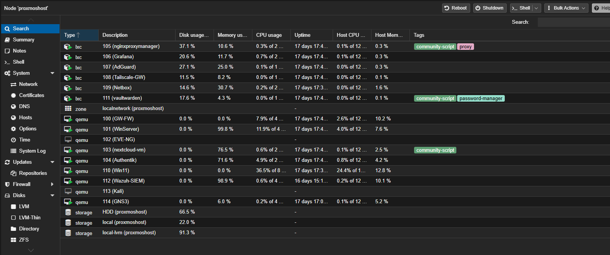
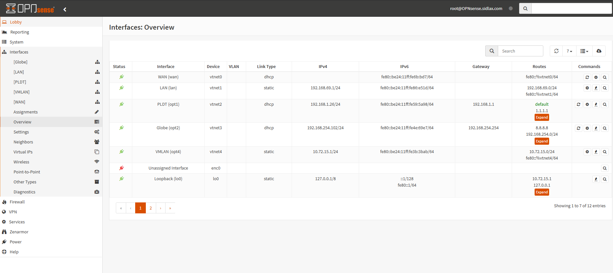
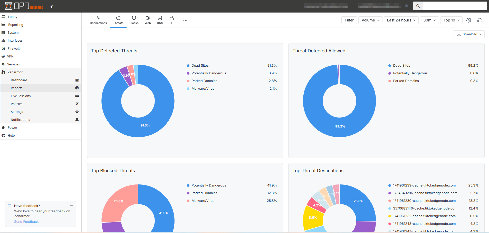
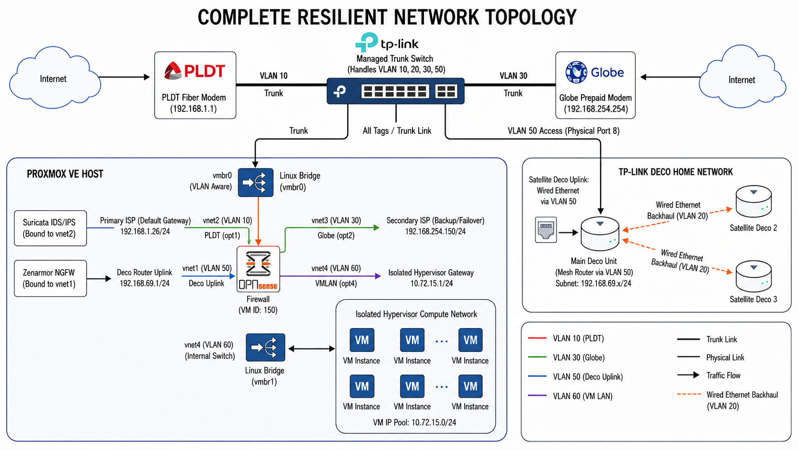

# Homelab Network Core

## Overview
This repository documents my homelab infrastructure built to practice **enterprise-style networking, virtualization, identity, monitoring, storage, and security operations**.

The environment is centered around **Proxmox VE** and uses an **OPNsense router-on-a-stick (ROAS)** design to provide firewalling, routing, WAN connectivity, and segmentation across multiple VLANs. On top of that network core, I run a set of infrastructure and self-hosted services used for **identity, DNS, PKI, monitoring, secrets management, documentation, media/storage, and network/security lab work**.

This homelab is both:
- a **working infrastructure platform** for internal services, and
- a **practice environment** for networking, cloud, and security engineering projects.

It also serves as the foundation for future portfolio work related to **SIEM/log pipelines, WAF testing, hybrid/cloud connectivity, and network automation**.

---

## Objectives
- Build a structured homelab using **Proxmox** as the primary virtualization platform
- Use **OPNsense** as a virtualized network edge for routing, firewalling, and segmentation
- Separate traffic and services using **VLANs** and policy enforcement
- Host practical infrastructure services such as **DNS, PKI, identity, IPAM, monitoring, and storage**
- Provide secure access to internal services using **reverse proxying and remote-access overlays**
- Maintain documentation and IP visibility through **NetBox**
- Use the lab as a platform for future **cloud, security, and network automation** projects

---

# Architecture Summary

## Virtualization Platform
- **Proxmox VE** – primary hypervisor for infrastructure and application virtual machines



## Network Core
- **OPNsense** – virtual firewall/router providing:
  - inter-VLAN routing
  - dual-WAN connectivity
  - firewall policy enforcement
  - gateway services for internal lab networks
- **Managed trunk switch** – carries tagged VLANs between physical network and Proxmox
- **Router-on-a-stick (ROAS)** design on Proxmox using a VLAN-aware bridge
- **TP-Link Deco mesh** connected through a dedicated VLAN/uplink path

  

## Security and Filtering
- **Suricata IDS/IPS**
- **Zenarmor NGFW**
- firewall policy and traffic separation through OPNsense
- **AdGuard Home** for DNS filtering / resolver functions



## Identity / Core Services
- **Windows Server** for:
  - **DNS**
  - **NPS**
  - **Certificate Authority**
- **Authentik** as the identity provider (IdP) / SSO platform
- **Vaultwarden** for password and credential management

## Infrastructure Documentation and IPAM
- **NetBox** for IPAM, infrastructure documentation, and inventory

## Monitoring and Visibility
- **PRTG**
- **Grafana**

## Remote Access and Internal Platforms
- **Tailscale gateway** for secure remote access
- **Nextcloud** for self-hosted cloud storage
- **Jellyfin**
- **Agent DVR**

## Network Lab / Practice Platforms
- **EVE-NG**
- **GNS3**

---

# Network Architecture

The homelab is built around an **OPNsense router-on-a-stick deployment running as a VM on Proxmox**.
## Topology Diagram

The current homelab network is built around an **OPNsense router-on-a-stick design on Proxmox**, with dual ISP handoff, a dedicated Deco/home uplink VLAN, and an isolated VM compute network for hosted services.



A **VLAN-aware Linux bridge (`vmbr0`)** on the Proxmox host carries multiple tagged networks from a managed switch into the OPNsense VM. This allows OPNsense to terminate multiple VLAN-backed interfaces while keeping the lab consolidated on a single virtualization platform.

## Current VLAN / Interface Design

### VLAN 10 – PLDT WAN
- Primary ISP handoff
- Presented to OPNsense as a dedicated WAN interface

### VLAN 30 – Globe WAN
- Secondary / backup ISP handoff
- Presented to OPNsense as a secondary WAN interface

### VLAN 50 – Deco / Home Network Uplink
- Used for the TP-Link Deco mesh uplink / home client network
- Routed separately from the internal VM compute network

### VLAN 60 – Internal VM / Compute Network
- Isolated network for virtual machines and internal infrastructure services hosted on Proxmox
- OPNsense acts as the gateway for this network

## Traffic Flow Summary
A managed switch trunks the required VLANs to the Proxmox host.  
Inside Proxmox, the OPNsense VM terminates the tagged interfaces and provides:

- routing between internal networks
- WAN connectivity and failover pathing
- firewall policy enforcement
- gateway services for the isolated VM network
- separation between home/client traffic and infrastructure workloads

---

# Core Infrastructure Services

## 1) OPNsense Firewall / Router
OPNsense acts as the central network control point of the lab and is responsible for:
- WAN connectivity
- inter-VLAN routing
- firewall policy enforcement
- segmentation between home/client traffic and infrastructure services
- gateway services for internal VMs
- security inspection features

Security tooling attached to the OPNsense platform includes:
- **Suricata IDS/IPS**
- **Zenarmor NGFW**

---

## 2) Windows Infrastructure
A dedicated **Windows Server** VM provides core internal services commonly found in enterprise environments:

- **DNS** – internal name resolution
- **NPS** – authentication-related lab scenarios such as RADIUS-based testing
- **Certificate Authority** – internal PKI and certificate issuance

This allows the lab to support certificate-based workflows and more realistic infrastructure testing.

---

## 3) Identity and Access
**Authentik** is used as the lab’s **identity provider (IdP)** for centralized authentication and SSO across supported internal services.

This supports:
- centralized authentication flows
- protected access to internal applications
- future identity-aware reverse proxy integrations
- more realistic access control for self-hosted services

---

## 4) DNS and Filtering
**AdGuard Home** is used for DNS filtering and resolver functionality within the environment.  
This supports:
- local DNS resolution workflows
- filtering / policy control for clients
- cleaner access to internal services
- visibility into DNS activity

---

## 5) IPAM and Infrastructure Documentation
**NetBox** is used as the source of truth for:
- IP address allocations
- VLAN and subnet documentation
- infrastructure inventory
- service and device tracking
- future topology and dependency documentation

One of the goals of this lab is to treat the environment like a real platform rather than an undocumented set of VMs, and NetBox is a big part of that.

---

## 6) Monitoring and Visibility
The environment includes a monitoring stack built around **PRTG** and **Grafana**.

### PRTG
Used for:
- infrastructure health monitoring
- reachability checks
- service monitoring
- network visibility

### Grafana
Used for:
- dashboards
- visualization of infrastructure data
- future integrations with additional telemetry sources

---

## 7) Secrets Management
**Vaultwarden** is hosted in the lab for password and credential management.

This helps keep operational credentials, service accounts, and internal access details managed more cleanly instead of being stored in ad hoc notes or local files.

---

## 8) Remote Access
A **Tailscale gateway** provides secure remote access into the homelab environment without broadly exposing internal services to the internet.

This supports:
- administrative access to internal systems
- remote troubleshooting
- access to services when away from home
- future hybrid / cloud connectivity experiments

---

## 9) Storage and User-Facing Services
The lab also hosts practical self-hosted services used for day-to-day functionality and testing.

### Nextcloud
Used as self-hosted cloud storage / internal file platform.

### Jellyfin
Used as a media service hosted inside the lab environment.

### Agent DVR
Used for video / surveillance-related workloads.

These services also help validate storage, reverse proxy, identity, and remote-access workflows in a more realistic way than purely synthetic lab VMs.

---

## 10) Network Lab Platforms
The environment includes **EVE-NG** and **GNS3** to support network simulation and lab work outside the core production-like services.

These platforms are used to:
- test network designs
- simulate routing / switching scenarios
- practice troubleshooting
- build isolated network labs without changing the core infrastructure environment

---

# Current Service Inventory
The current homelab platform includes the following major services and systems:

- **Proxmox VE**
- **OPNsense**
- **Windows Server** (DNS / NPS / CA)
- **Authentik**
- **AdGuard Home**
- **NetBox**
- **Vaultwarden**
- **PRTG**
- **Grafana**
- **Tailscale gateway**
- **Nextcloud**
- **Jellyfin**
- **Agent DVR**
- **EVE-NG**
- **GNS3**

---

# High-Level Topology
The current topology includes:

- **Dual ISP connectivity**
  - PLDT (primary)
  - Globe (secondary / backup)

- **Managed trunk switch**
  - carries VLAN 10 / 30 / 50 / 60

- **Proxmox host**
  - VLAN-aware bridge for OPNsense ROAS
  - isolated VM network for hosted services

- **Deco home network**
  - connected through a dedicated VLAN/uplink path

- **Internal infrastructure network**
  - hosts Windows services, identity, monitoring, storage, and supporting applications

A topology diagram for this design will be included in the repository.

---

# Security Design Goals
This lab is designed with practical infrastructure security in mind. Key goals include:

- segmenting infrastructure and user/client traffic
- using firewall policy enforcement between services and networks
- limiting unnecessary exposure of internal services
- centralizing identity where possible
- using internal PKI for certificate-based workflows
- improving visibility with monitoring and security tooling
- documenting assets, IPs, and infrastructure relationships

---

# Why This Lab Exists
This homelab is not just for hosting apps. It is my working platform for building practical experience in:

- **network engineering**
- **cloud-connected infrastructure**
- **security operations**
- **identity and access**
- **monitoring and observability**
- **documentation and infrastructure hygiene**
- **network simulation and testing**

It is also the base platform for future portfolio projects related to:
- AWS / hybrid networking
- SIEM / log pipelines
- reverse proxy and WAF security
- network automation
- cloud/security architecture

---

# Repository Roadmap
This repository will be expanded with:

- **topology diagrams**
- **VLAN / subnet documentation**
- **VM inventory**
- **service dependency notes**
- **reverse proxy / access flow notes**
- **NetBox structure documentation**
- **monitoring screenshots**
- **lessons learned and design decisions**
- **sanitized configuration examples**

---

# Repository Structure
```text
homelab-network-core/
├─ README.md
├─ diagrams/
├─ screenshots/
├─ configs/
└─ notes/

